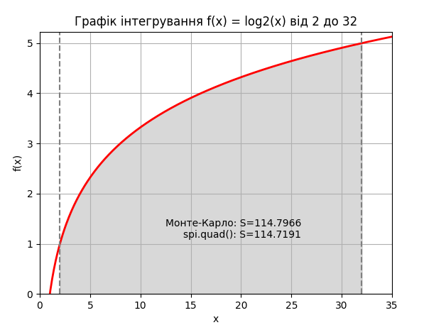

# Лінійне програмування та рандомізовані алгоритми

## Оптимізація виробництва

В модулі `1_pulp.py` розв’язано задачу оптимізації для наступних умов:

Компанія виробляє два види напоїв: "Лимонад" і "Фруктовий сік". Для виробництва цих напоїв використовуються різні інгредієнти та обмежена кількість обладнання. Задача полягає у максимізації виробництва, враховуючи обмежені ресурси.

Обмеження ресурсів:

1.  "Лимонад" виготовляється з "Води", "Цукру" та "Лимонного соку".
2.  "Фруктовий сік" виготовляється з "Фруктового пюре" та "Води".
3.  Обмеження ресурсів: 100 од. "Води", 50 од. "Цукру", 30 од. "Лимонного соку" та 40 од. "Фруктового пюре".
4.  Виробництво одиниці "Лимонаду" вимагає 2 од. "Води", 1 од. "Цукру" та 1 од. "Лимонного соку".
5.  Виробництво одиниці "Фруктового соку" вимагає 2 од. "Фруктового пюре" та 1 од. "Води".

За допомогою модуля PuLP отримано наступні оптимальні значення для продукції:

-   Лимонаду: 30.0 од.
-   Фруктового соку: 20.0 од.

## Обчислення визначеного інтеграла методом Монте-Карло

В модулі 2_monte_carlo.py розраховано визначений інтеграл функції методом Монте-Карло, та порівняно результати із методом `integrate.quad` із модуля `scipy`.

Для розрахунків з 1млн точок абсолютна похибка методу Монте-Карло в порівнянні з функцією quad складає 0,0775.

Підвищити точність результатів методу Монте-Карло можна шляхом:

-   збільшення кількості точок для перевірки
-   проведення кількох вимірювань і обрахунком середнього значення
